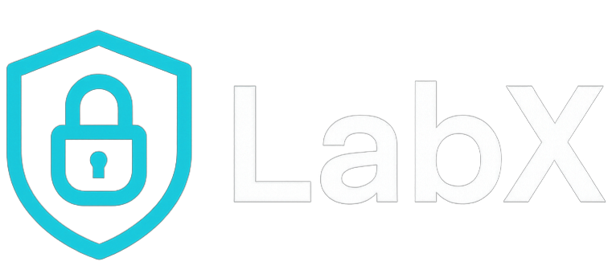

  
<h1 align="center">
    
</h1>
  
  

  <h1>Advanced Cybersecurity Lab for security monitoring, detection, and offensive security training.</h1>
  
  

  Welcome to LabX — Simulate Attacks. Strengthen Defenses.
  

  
  
<!-- Badges -->

  
  
  
  
  
  

   
<h4>
    <a href="https://github.com/Raouf-Braham/LabX">Documentation</a>
   · 
    <a href="https://github.com/Raouf-Braham/LabX/issues/">Report Bug</a>
   · 
    <a href="https://github.com/Raouf-Braham/LabX/issues/">Request Feature</a>
  </h4>

 

<!-- Table of Contents -->
# Table of Contents

- [About the Project](#about-the-project)
  * [Mission](#mission)
  * [Tutorial](#tutorial)
  * [Tech Stack](#tech-stack)
  * [Features](#features)
  * [Color Reference](#color-reference)
- [Getting Started](#getting-started)
  * [Run Locally](#run-locally)
- [Usage](#usage)
- [Roadmap](#roadmap)
- [Contributing](#contributing)
  * [Code of Conduct](#code-of-conduct)
- [License](#license)
- [Contact](#contact)
- [Acknowledgements](#acknowledgements)
  

<!-- About the Project -->
## About the Project

<!-- Mission -->
### Mission
The mission of this project is to provide a structured, safe, and realistic lab environment to practice cybersecurity skills including SIEM setup, Active Directory configuration, IDS deployment, firewall rules, and offensive tactics using Kali Linux.

<!-- Tutorial -->
### Tutorial

New to LabX? Here's how to get started:

1. Homelab Architecture

2. VM & Host Setup

3. PfSense Setup

4. Security Onion

   

5. Kali Linux

6. Windows Server & Domain Controller

7. Splunk Setup

 

https://github.com/user-attachments/assets/6c08f287-4ade-4eb8-bcee-777adc5163ba

<!-- TechStack -->
### Tech Stack

This project is built with:

- VMware Workstation Pro / VirtualBox (Hypervisor)

- pfSense (Firewall)

- Security Onion (IDS, SIEM)

- Kali Linux (Attack machine)

- Windows Server 2019 (Domain Controller)

- Windows 10 (Domain clients)

- Ubuntu Server + Splunk (SIEM)

<!-- Features -->
### Features

- Fully segmented network with pfSense firewall

- Detection and monitoring via Security Onion and Splunk

- Active Directory environment for enterprise simulation

- Offensive testing with Kali Linux

- SIEM data ingestion using Splunk Universal Forwarder

<!-- Getting Started -->
## Getting Started

<!-- Run Locally -->
### Run Locally

1. Build or prepare host PC

2. Install VMware or VirtualBox

3. Create and configure each VM:

 • pfSense: Configure interfaces, firewall rules

 • Security Onion: IDS/SIEM configuration

 • Kali Linux: Set up attack machine

 • Windows Server: Promote to Domain Controller

 • Windows 10: Join to the domain

 • Ubuntu + Splunk: Install Splunk, configure GUI and indexes

4. Connect machines to proper VMnet interfaces

5. Test connectivity and domain functionality

<!-- Usage -->
## Usage

Use this lab to:

 • Practice AD enumeration and exploitation

 • Monitor logs in Security Onion and Splunk

 • Write and test detection rules

 • Train on red vs blue team scenarios

<!-- Roadmap -->
## Roadmap
 • Add automation scripts for faster VM setup
 
 • Expand with cloud-based integration (e.g., Azure Sentinel)
 
 • Include Docker-based simulation for constrained environments

<!-- Contributing -->
## Contributing

Contributions are always welcome!

See `contributing.md` for ways to get started.

<!-- Code of Conduct -->
### Code of Conduct

Please read the [Code of Conduct](https://github.com/Raouf-Braham/HoneyShield/blob/master/CODE_OF_CONDUCT.md)

<!-- License -->
## License

Distributed under the no License. See LICENSE.txt for more information.

<!-- Contact -->
## Contact

Linkedin - [@Raouf Braham](https://www.linkedin.com/in/raouf-braham-67b365251/) | Email - raouf.brahem@eniso.u-sousse.tn

Project Link: [https://github.com/Raouf-Braham/HoneyShield](https://github.com/Raouf-Braham/HoneyShield)

<!-- Acknowledgments -->
## Acknowledgements

• MongoDB — Database for storing logs

• Plotly / Chart.js — Optional charting libraries

• Inspired by modern honeypot practices

• All contributors and testers
